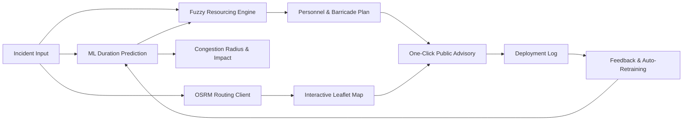

# 🚦 TraffiSense AI — Traffic Intelligence Engine

Predictive traffic intelligence dashboard for event-driven congestion — forecasts gridlock impact and recommends resource deployment before it happens.

**Live Demo:** [traffi-sense-ai-neon.vercel.app](https://traffi-sense-ai-neon.vercel.app)  
**API Docs:** [traffisense-ai-2.onrender.com/docs](https://traffisense-ai-2.onrender.com/docs) *(Bare API root `/` returns `{"status": "ok", "service": "TraffiSense AI backend"}`)*

---

## 📌 Overview

Planned events (concerts, matches, rallies) and unplanned incidents (accidents, waterlogging, breakdowns) create localized traffic breakdowns across a city. Today, that impact is rarely quantified in advance — resource deployment (officers, barricades, diversions) is largely experience-driven, with no systematic post-event learning loop.

**TraffiSense AI** predicts how long an incident will block traffic, how far the congestion is likely to ripple, and exactly what resources a precinct should deploy — using a machine learning model trained on historical Bengaluru traffic-event data coupled with an IRC:SP:55/MoRTH-aligned fuzzy decision engine.

---

## 🚀 Core Workflow



1. **Event Input** — an operator logs an incident: cause, location coordinates, corridor, vehicle type, priority, crowd size, and description.
2. **ML Inference** — a Scikit-Learn `GradientBoostingRegressor`, trained on historical resolution times, predicts expected clearance duration from the event's spatial, temporal, and categorical features.
3. **Fuzzy Logic Resourcing** — the predicted duration, corridor priority, severity score, and crowd size are run through a `scikit-fuzzy` control system to derive personnel and barricade counts.
4. **Spatial Analytics** — DBSCAN clustering surfaces recurring incident hotspots and corridor-level hourly patterns from the historical dataset, computed live and filterable by hour and month.
5. **Diversion Routing & Mapping** — a driving route around the incident is fetched from OSRM and rendered on an interactive Leaflet/OpenStreetMap view, along with a congestion-radius overlay.
6. **Automated Advisory** — one click generates a pre-formatted public advisory ready to post to WhatsApp or X (Twitter).
7. **Feedback Loop** — resolved deployments are logged with actual outcomes, triggering automated background model retraining with validation and rollback support.

---

## 🛠️ Tech Stack

| Layer | Technologies |
|---|---|
| **Frontend** | React 19, Vite 6, Tailwind CSS v4, Leaflet, React-Leaflet, Recharts, Axios, Oxlint |
| **Backend** | FastAPI, Python 3.11+, Uvicorn, Pydantic V2 |
| **ML & Analytics** | Scikit-Learn (`GradientBoostingRegressor`), Scikit-Fuzzy, Pandas, NumPy, SciPy (ConvexHull, DBSCAN, BallTree) |
| **Database** | SQLAlchemy, PostgreSQL (production), SQLite (local development) |
| **Routing** | OSRM (Open Source Routing Machine API client with caching & fallback) |
| **Infrastructure** | Vercel (Frontend), Render (Backend + Managed Postgres), GitHub Actions (CI/CD) |

---

## 🏗️ Repository Structure

```
TraffiSense-AI/
├── .github/
│   └── workflows/
│       ├── ci.yml                 # Backend & ML CI test pipeline
│       ├── frontend.yml           # Frontend build validation
│       ├── pr-check.yml           # Pull request unit tests & build checks
│       └── codeql.yml             # CodeQL static security analysis
├── backend/
│   ├── main.py                    # FastAPI application, route handlers, DBSCAN & analytics
│   ├── ml_model.py                # GradientBoostingRegressor training, validation & promotion
│   ├── fuzzy_engine.py            # IRC:SP:55 / MoRTH-aligned fuzzy logic control system
│   ├── data_pipeline.py           # Dataset cleaning, feature extraction & spatial imputation
│   ├── db.py                      # SQLAlchemy storage (PostgreSQL/SQLite) & retraining lock
│   ├── routing.py                 # Resilient OSRM diversion routing client with caching
│   ├── requirements.txt           # Production dependencies
│   ├── requirements_train.txt     # Training & test dependencies (pytest, httpx)
│   └── README.md                  # Backend-specific architecture & API guide
├── frontend/
│   ├── index.html                 # Single page application entry point
│   ├── package.json               # Frontend scripts & dependencies
│   ├── vite.config.js             # Vite configuration with Tailwind CSS v4
│   ├── vercel.json                # Vercel deployment & rewrite configuration
│   ├── src/
│   │   ├── App.jsx                # Layout controller & view state management
│   │   ├── LeafletMap.jsx         # Interactive Leaflet map (routes, markers, radius)
│   │   ├── Analytics.jsx          # City-wide charts & KPI visualizer
│   │   ├── GridMap.jsx            # 0.5 km² density grid map & DBSCAN polygon layers
│   │   ├── Feedback.jsx           # Deployment tracking & post-event feedback modal
│   │   ├── constants.js           # Shared enums, bounds, and API configuration
│   │   ├── utils/fixLeafletIcons.js # Leaflet marker asset resolver
│   │   └── components/
│   │       ├── Header.jsx         # Navigation bar & platform features modal
│   │       ├── LandingPage.jsx    # Scenario starters & control center entry
│   │       ├── LiveFeeds.jsx      # Simulated live event feed aggregator
│   │       ├── SidebarForm.jsx    # Incident parameter entry panel
│   │       └── ResultsPanel.jsx   # Prediction metrics, ROI, map & advisory modal
│   └── README.md                  # Frontend-specific architecture & component guide
├── ml/
│   ├── model.joblib               # Trained GradientBoostingRegressor artifact
│   ├── feature_importance.csv     # Extracted feature importance scores
│   └── feature_importance.png     # Feature importance visualization plot
├── tests/
│   ├── test_backend.py            # API request validation & police station tests
│   ├── test_fuzzy_engine.py       # Scikit-fuzzy resourcing & FAM rule tests
│   ├── test_ml.py                 # ML artifact presence tests
│   ├── test_retraining.py         # Retraining pipeline, locking & feedback tests
│   └── test_routing.py            # OSRM routing resilience & cache tests
├── dataset.csv                    # Historical Bengaluru traffic-event dataset
├── docker-compose.osrm.yml        # Self-hosted OSRM container stack
├── render.yaml                    # Render deployment blueprint
└── README.md                      # Project documentation
```

---

## 🎯 Key Features

- **Predictive Clearance Modeling** — Estimates incident clearance duration based on historical patterns, spatial coordinates, road closures, and severity keywords.
- **Fuzzy Logic Resource Allocation** — Derives precise officer headcounts and barricade counts using a 4-variable fuzzy associative memory control system.
- **Dynamic DBSCAN Spatial Clustering** — Auto-discovers recurring risk zones using haversine metric (500m radius, min 10 points) rendered with convex hulls.
- **0.5 km² Grid Density Analytics** — Explores traffic breakdown densities across Bengaluru with interactive hour-of-day and month-of-year filters.
- **Live Diversion Mapping** — Generates turn-by-turn street diversion routes via OSRM with automatic caching and simulated fallback.
- **ROI & Delay Savings** — Quantifies commuter time saved with AI-assisted response vs. unmanaged gridlock.
- **One-Click Public Advisory** — Auto-generates hashtag-ready broadcast copy for WhatsApp channels and X (Twitter).
- **Continuous Feedback Loop & Safe Retraining** — Resolves active incidents with real-world outcomes, safely evaluating and promoting new model weights in the background.

---

## 🏁 Getting Started

### Prerequisites
- **Node.js** 18+ and **npm** 9+
- **Python** 3.11+

---

### Backend Setup

1. **Navigate to the backend directory and set up a virtual environment:**
   ```bash
   cd backend
   python -m venv venv
   ```

2. **Activate the virtual environment:**
   - **Windows (PowerShell):**
     ```powershell
     .\venv\Scripts\Activate.ps1
     ```
   - **Windows (Command Prompt):**
     ```cmd
     venv\Scripts\activate.bat
     ```
   - **Linux / macOS:**
     ```bash
     source venv/bin/activate
     ```

3. **Install dependencies:**
   ```bash
   pip install -r requirements.txt -r requirements_train.txt
   ```

4. **Train and prepare the ML model artifact:**
   ```bash
   python ml_model.py
   # Copy artifact to the backend directory:
   # On Windows (PowerShell):
   Copy-Item ..\ml\model.joblib .\model.joblib
   # On Linux / macOS:
   cp ../ml/model.joblib ./model.joblib
   ```

5. **Start the FastAPI server:**
   ```bash
   uvicorn main:app --reload --port 8000
   ```
   - API Root: `http://127.0.0.1:8000`
   - Interactive Swagger Docs: `http://127.0.0.1:8000/docs`
   - ReDoc: `http://127.0.0.1:8000/redoc`

---

### Frontend Setup

1. **Navigate to the frontend directory:**
   ```bash
   cd frontend
   ```

2. **Install Node dependencies:**
   ```bash
   npm install
   ```

3. **Start the development server:**
   ```bash
   npm run dev
   ```
   The dashboard will be available at `http://localhost:5173`.

---

## 🧪 Running Automated Tests

### Python Backend & ML Test Suite
Run all unit and integration tests across `tests/` and `backend/`:
```bash
# From repository root:
pytest tests backend/ -v
```

### Frontend Linting & Build Verification
```bash
cd frontend
npm run lint
npm run build
```

---

## 🗺️ Routing Service Configuration

Diversion routes are generated by calling an OSRM-compatible routing service (`backend/routing.py`). By default, it targets the public OSRM demo server (`router.project-osrm.org`) for zero-configuration local development.

### Environment Variables

| Variable | Default | Description |
|---|---|---|
| `OSRM_BASE_URL` | `http://router.project-osrm.org` | Base URL of the routing service. |
| `OSRM_PROFILE` | `driving` | Routing profile (`driving` / `walking` / `cycling`). |
| `OSRM_TIMEOUT_SECONDS` | `1.2` | Per-request timeout in seconds. |
| `OSRM_MAX_RETRIES` | `1` | Number of retry attempts on network / 5xx errors. |
| `OSRM_RETRY_BACKOFF_SECONDS` | `0.1` | Base backoff interval between retries. |
| `ROUTE_CACHE_TTL_SECONDS` | `300` | In-memory cache TTL for diversion routes. |
| `ROUTE_CACHE_MAX_SIZE` | `500` | Maximum cached route entries. |

### Self-Hosting OSRM via Docker

To run a dedicated, high-performance OSRM instance for Bengaluru/Karnataka:

```bash
docker compose -f docker-compose.osrm.yml up -d
```
Then configure the backend to use your self-hosted instance:
```bash
export OSRM_BASE_URL=http://localhost:5000
```

---

## ☁️ Deployment

This project is architected for continuous deployment:

- **Frontend (Vercel)**: Configured via `frontend/vercel.json`. Set `VITE_API_URL` to your production backend URL.
- **Backend (Render)**: Configured via `render.yaml`. Provisions a Python web service and a managed PostgreSQL database.

---

## 📄 License

This project is licensed under the [MIT License](LICENSE).
